# Отчёт: исследование RAG-системы по Dota 2

Все цифры получены скриптами из этой папки: `run_retrieval.py` (этапы S1–S7, без LLM),
`run_generation.py` (LLM × промпт, судья) и `make_figures.py` (графики). Сырые результаты лежат в
[results/](results/), лучшая конфигурация — в [results/best_config.json](results/best_config.json).

**Итог в одной строке:** от базовой конфигурации (section-256, e5-small, dense, без reranker'а) до
итоговой (section-128, bge-m3, hybrid, reranker bge-m3) качество поиска выросло с **MRR 0,635 до 0,885**,
доля вопросов с правильным фрагментом на 1-м месте — **с 50% до 85%**. Строгий промпт даёт
**100% корректных отказов** на вопросах без ответа, базовый промпт — 0%: модель выдумывает ответы.

---

## 1. Данные

### 1.1 Источники и сбор

| Источник | Способ | Язык | Документы |
|---|---|---|---|
| dota2.com (официальный сайт) | JSON-эндпоинты `/datafeed/*`, которые использует сам сайт | RU | 127 героев, 408 предметов, 6 последних патчей |
| Dota 2 Wiki (Fandom) | MediaWiki API: `prop=info` (версии) + `action=parse` (HTML) | EN | 125 героев, 99 страниц механик |
| **Итого** | | | **765 документов, ≈ 4 млн символов** |

**Почему так.** Страницы официального сайта рендерятся JavaScript'ом, и парсить HTML пришлось бы
через headless-браузер. Но данные сайт получает из открытого JSON API, поэтому grabber ходит туда
напрямую: получается структурированный текст на русском. Fandom добавляет то, чего на официальном
сайте нет: механики (броня, развеивание, уклонение) и подробные заметки к способностям.
**Альтернатива:** Liquipedia (киберспорт) — отказались из-за жёстких лимитов API (1 запрос в 2 с,
`parse` — 1 запрос в 30 с) и потому, что турнирные таблицы плохо подходят для вопросов-ответов.

**Инкрементальность** (журнал запусков — таблица `runs` в `data/manifest.db`):

| Запуск | Источник | new | updated | unchanged | skipped | HTTP-запросов |
|---|---|---|---|---|---|---|
| первый | official | 538 | 0 | 3 | 0 | 545 |
| первый | fandom | 221 | 0 | 0 | 3 | 229 |
| повторный, после исправления парсера | official | 0 | 148 | 387 | 6 | 538 |
| `--reparse` (без скачивания) | official | 0 | 359 | 182 | 0 | **4** |
| `--reparse` | fandom | 0 | 0 | 224 | 0 | **8** |

- Fandom сверяется по `revid` страницы, который приходит пачками по 50 через `prop=info`: неизменённые страницы вообще не скачиваются.
- Патчи сверяются по номеру версии, остальное — по SHA-256 содержимого.
- Дубликаты отсекаются по хешу, исчезнувшие у источника документы помечаются `removed`.
- Ошибка одного документа не роняет прогон: он записывается в манифест как `failed`.
- `--reparse` пересобирает документы из сохранённых сырых ответов: после правки парсера источник повторно не нагружается.

### 1.2 Очистка и нормализация

Главный источник мусора — вики. На одной странице героя Fandom было **158 блоков-ошибок сломанных
шаблонов** (в основном «Lua error in Module:…»). Кроме того: вкладки-табберы, звуки, галереи,
«File:…» от битых картинок, формулы в TeX, навбоксы. Парсер удаляет их по CSS-селекторам, а
секции без знаний (Gallery, Recent Changes, Recommended Items и др.) пропускает целиком.

В официальных данных были свои артефакты, найденные при ручной проверке:

| Было | Стало |
|---|---|
| `%blink_range%`, `{s:value}` | числа из `special_values` («до 1200») |
| «сожжёт 0% маны» (улучшение Aghanim's Scepter) | значения из `values_scepter` |
| `+$str: 10` | «Бонус: +10 к силе» |
| «Нейтральный предмет, уровень 4294967296» | строка убрана (это −1, прочитанное как беззнаковое) |
| `bonus_AbilityCooldown` в талантах | значения из `bonuses` способностей |

Нормализация: Unicode NFKC, единые кавычки и тире, удаление невидимых символов, склейка
«осиротевших» строк после HTML (`and his` / `Allies` / `, returning…`), удаление повторов длинных строк.
Способности героя на Fandom выделены в отдельные подсекции (`Abilities / Mana Break`): так ссылки
на источник получаются точнее.

---

## 2. Как оценивали

### 2.1 Датасет

41 вопрос на русском (+ перевод на английский для эксперимента с языком): [data/eval/questions.jsonl](../data/eval/questions.jsonl).

| Тип | Кол-во | Пример |
|---|---|---|
| фактологический | 8 | «Сколько стоит Blink Dagger?» |
| поиск конкретной информации | 11 | «Какая перезарядка у Mana Void у Anti-Mage?» |
| по нескольким документам | 8 | «Как менялась Battle Hunger у Axe в патчах 7.41d и 7.41e?» |
| понимание контекста | 7 | «Anti-Mage пытается сделать Blink на 100 единиц. На какое расстояние он переместится?» |
| ответа нет в базе | 7 | «Кто выиграл The International 2019?» |

**Эталон размечен на уровне «документ + секция», а не chunk'а.** Поэтому один датасет подходит
для любой стратегии разбиения: chunk считается релевантным, если он из нужного документа и
покрывает нужную секцию. Все 43 эталонные ссылки проверены скриптом на существование.

### 2.2 Метрики и почему именно они

| Метрика | Что показывает | Зачем |
|---|---|---|
| **Hit@K** | есть ли хоть один нужный фрагмент в первых K | LLM не ответит, если нужного фрагмента нет в контексте |
| **MRR** | насколько высоко первый нужный фрагмент | главная метрика выбора: в контекст идут только top-5 |
| Recall@K | доля эталонных секций, найденных в top-K | для вопросов по нескольким документам |
| nDCG@K, Precision@K | качество порядка и «шум» в выдаче | дополнительно |
| **correctness** (судья, 1–5) | совпадение с эталонным ответом | правильность |
| **faithfulness** (судья, 1–5) | подтверждается ли ответ контекстом | галлюцинации |
| relevancy (судья, 1–5) | отвечает ли на заданный вопрос | |
| **доля верных отказов** | отказ на вопросах без ответа / ответ на остальные | защита от галлюцинаций |

Метрики поиска считаются без LLM — быстро, бесплатно и детерминированно, поэтому 6 из 7 этапов
обошлись без API. Судья — **Gemini** (другое семейство, чем генераторы gpt-oss и Qwen), чтобы
модель не оценивала сама себя. Правило выбора на каждом этапе: максимальный MRR, при равенстве —
Recall@5. Лучший вариант этапа фиксируется и идёт дальше.

---

## 3. Эксперименты с поиском

### S1. Стратегия и размер chunk'а

**Гипотеза:** разбиение по смысловым границам (секции, абзацы) лучше фиксированного окна.
Альтернативы: fixed, paragraph, section × 128 / 256 / 512 токенов (e5-small, dense).

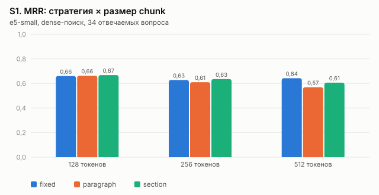

| Стратегия | 128 | 256 | 512 |
|---|---|---|---|
| fixed | 0,660 | 0,628 | 0,643 |
| paragraph | 0,663 | 0,610 | 0,569 |
| section | **0,668** | 0,635 | 0,606 |

**Результат:** во всех трёх стратегиях лучше всего работают **мелкие chunk'и (128 токенов)**.
Крупный chunk смешивает несколько фактов, и его вектор «размывается». Лучший вариант —
**section-128**, хотя разница между стратегиями при 128 токенах небольшая (0,660–0,668).
Section выбран ещё и потому, что chunk не пересекает границы секций: ссылка «Anti-Mage — Mana Void»
всегда указывает ровно туда, откуда взят текст. У fixed-окон это не так.

### S2. Overlap

Fixed-128 с перекрытием 0 / 12 / 25 / 50%.

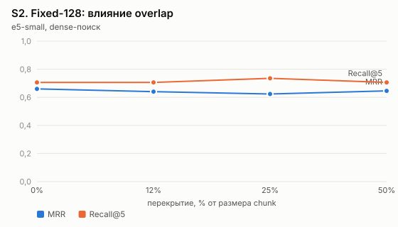

| Overlap | Chunks | MRR | Recall@5 |
|---|---|---|---|
| 0% | 9 038 | **0,660** | 0,706 |
| 12% | 10 204 | 0,640 | 0,706 |
| 25% | 11 730 | 0,624 | 0,735 |
| 50% | 17 099 | 0,646 | 0,706 |

**Результат:** overlap **не помог**, а индекс вырос почти вдвое. Перекрытие спасает, когда факт
разрезан границей окна, но у нас короткие справочные тексты, где факты и так умещаются в 128 токенов,
а дубли фрагментов вытесняют из top-K другие документы. **Выбор: без overlap** (section-128).

### S3. Заголовок «Документ — Секция» в начале chunk'а

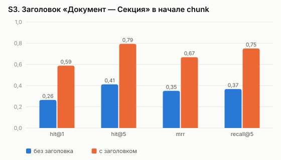

| | Hit@1 | Hit@5 | MRR |
|---|---|---|---|
| без заголовка | 0,265 | 0,412 | 0,350 |
| **с заголовком** | **0,588** | **0,794** | **0,668** |

**Самый сильный эффект во всём исследовании: MRR почти вдвое выше.** Без заголовка chunk
«Перезарядка: 100 / 85 / 70 сек.» не знает, что речь про Mana Void у Anti-Mage, и не находится
по вопросу, где названы герой и способность.

### S4. Embedding-модели и язык вопроса

Все модели мультиязычные (корпус RU + EN, вопросы на RU), у всех токенизатор XLM-R.

| Модель | Параметры | Размерность | Индекс на GPU* | На CPU ноутбука** |
|---|---|---|---|---|
| multilingual-e5-small | 118M | 384 | 32 с | ≈ 8 мин |
| paraphrase-multilingual-MiniLM-L12 | 118M | 384 | 45 с | ≈ 8 мин |
| multilingual-e5-base | 278M | 768 | 81 с | ≈ 25 мин |
| **bge-m3** | 568M | 1024 | 179 с | ≈ 1,5 ч |

\* RTX 5060 Ti, 11 448 chunks, **включая загрузку модели** (сама векторизация — секунды).
\*\* Ryzen 5 220 без GPU: для e5-small измерено (~15 chunks/с), для остальных — оценка по размеру модели.

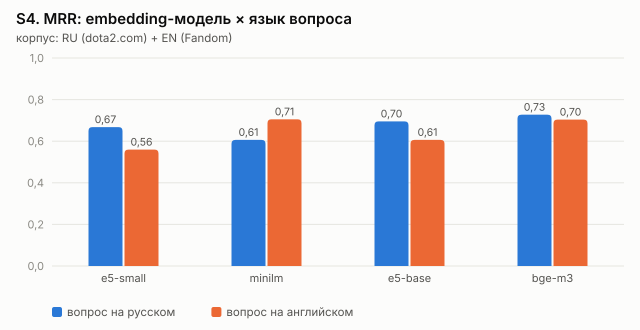

| Модель | MRR, вопрос RU | MRR, вопрос EN | Hit@5 (RU) |
|---|---|---|---|
| e5-small | 0,668 | 0,560 | 0,794 |
| MiniLM | 0,606 | **0,705** | 0,765 |
| e5-base | 0,695 | 0,606 | 0,824 |
| **bge-m3** | **0,727** | 0,704 | **0,912** |

**Результаты:**
- **bge-m3** лучше всех на русских вопросах (MRR 0,727, Hit@5 0,912) и почти не теряет качество при
  смене языка (0,727 → 0,704): кросс-язычный поиск RU → EN он переносит лучше всех.
- **MiniLM** обучен на парафразах и сильно зависит от языка: на английских вопросах он лучший (0,705),
  на русских — худший (0,606). Для нашего смешанного корпуса это плохой выбор.
- e5 на русских вопросах работает лучше, чем на английских: большая часть корпуса (официальный сайт) — русская.

**Выбор: bge-m3.** Цена — в 5 раз больше параметров и векторы 1024 вместо 384. Но индекс строится
один раз (векторы кэшируются: на ноутбуке итоговый индекс собрался из кэша за 26 с), а для запроса
векторизуется только сам вопрос — это доли секунды.

### S5. Dense vs BM25 vs Hybrid

Hybrid — объединение списков dense и BM25 через Reciprocal Rank Fusion.

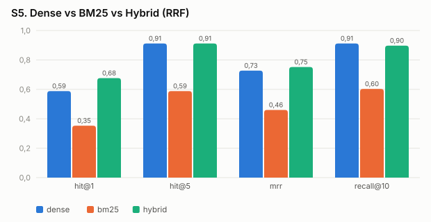

| Режим | Hit@1 | Hit@5 | MRR |
|---|---|---|---|
| dense | 0,588 | 0,912 | 0,727 |
| BM25 | 0,353 | 0,588 | 0,460 |
| **hybrid** | **0,676** | 0,912 | **0,752** |

**Результат:** BM25 один слаб (вопросы на русском, половина корпуса на английском, словесного
совпадения нет), но в паре с dense он поднимает Hit@1 с 0,59 до 0,68: точные названия
(«Culling Blade», «7.41f») BM25 ловит лучше векторов. **Выбор: hybrid.**

### S6. Top-K и reranker

**Top-K.** Recall растёт с K: при K = 20 нужный фрагмент есть в выдаче у 97% вопросов (bge-m3),
при K = 5 — у 91%. Но в LLM нельзя отдать 20 фрагментов: растут токены и шум. Поэтому схема
такая: достать **K кандидатов → переранжировать → отдать 5**.

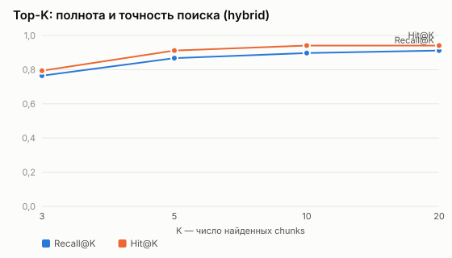

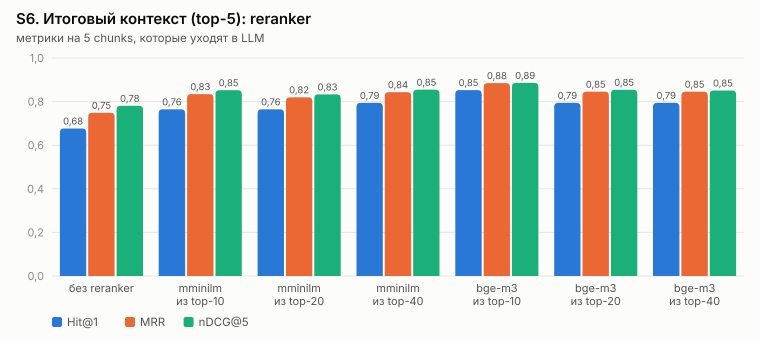

| Reranker | Кандидатов | Hit@1 | MRR | nDCG@5 | Задержка |
|---|---|---|---|---|---|
| без reranker | 20 | 0,676 | 0,749 | 0,781 | 0,04 с |
| mMiniLM | 10 | 0,765 | 0,834 | 0,852 | 0,1 с |
| mMiniLM | 40 | 0,794 | 0,843 | 0,855 | 0,14 с |
| **bge-reranker-v2-m3** | **10** | **0,853** | **0,885** | **0,886** | 0,2 с** |
| bge-reranker-v2-m3 | 40 | 0,794 | 0,846 | 0,851 | 0,45 с |

\*\* на GPU. В сырых результатах первая строка каждого reranker'а (0,86 с и 2,2 с) включает загрузку
модели; здесь указано время без неё.

**Результаты:**
- Reranker даёт **+18% MRR** (0,749 → 0,885) и +26% Hit@1. Cross-encoder читает вопрос и фрагмент
  вместе, а не сравнивает два независимых вектора.
- **Больше кандидатов — не лучше:** для bge-reranker top-10 лучше, чем top-40. Среди дальних
  кандидатов попадаются «похожие, но не те» фрагменты (соседние герои, похожие предметы), которые
  reranker иногда поднимает выше нужного.

**Выбор: bge-reranker-v2-m3, 10 кандидатов → 5 в контекст.**

### S7. Фильтрация: пороги

Для каждого вопроса взяты максимальные скоры после поиска и после reranker'а.

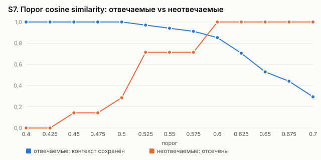
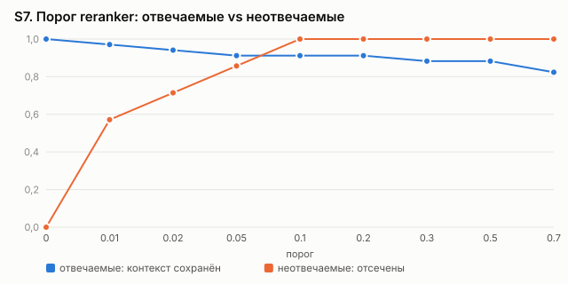

| Скор | Отвечаемые (min / среднее) | Неотвечаемые (max / среднее) |
|---|---|---|
| cosine (bge-m3) | 0,504 / 0,658 | 0,589 / 0,522 |
| reranker | 0,007 / 0,837 | **0,077** / 0,018 |

**Результаты:**
- **Порог по cosine similarity не работает:** диапазоны пересекаются. Чтобы отсечь все вопросы без
  ответа, нужен порог 0,6, но он теряет 15% отвечаемых.
- **Порог reranker'а 0,1 разделяет почти идеально:** отсекает **100%** вопросов без ответа и
  сохраняет контекст у **91%** отвечаемых (balanced accuracy 0,956).
- Остальные фильтры включены всегда: минимальная длина chunk'а (60 символов) и дедупликация по
  Jaccard-сходству шинглов (≥ 0,85).

Порог 0,1 используется как «ворота» отказа: если ни один фрагмент его не прошёл, LLM не вызывается.
Его эффект на ответы — в разделе 4.

---

## 4. Генерация

Retrieval — итоговая конфигурация из раздела 3. Модели — open-weight через Groq (бесплатно):

| | gpt-oss-120b | qwen3.8-27b |
|---|---|---|
| Разработчик | OpenAI (open-weight) | Alibaba |
| Размер | 120B (MoE) | 27B |

Промпты ([src/generation/prompts.py](../src/generation/prompts.py)):
- **strict** — только контекст, ссылка `[n]` после каждого утверждения, фиксированная фраза отказа;
- **basic** — «вот фрагменты, которые могут помочь, ответь на вопрос».

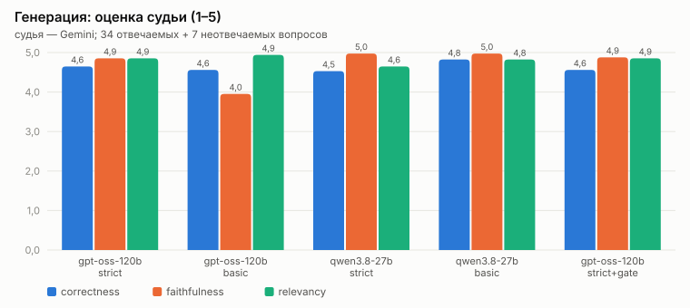
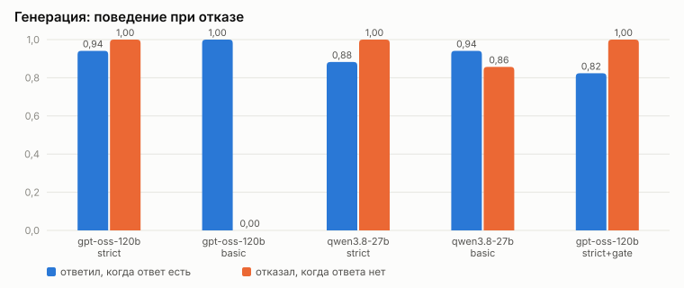

| Вариант | Correctness | Faithfulness | Отказ без ответа | Ответ, когда он есть | Со ссылками | Время* |
|---|---|---|---|---|---|---|
| **gpt-oss-120b / strict** | **4,65** | 4,85 | **100%** | 94% | 94% | 3,1 с |
| gpt-oss-120b / basic | 4,56 | **3,95** | **0%** | 100% | 0% | 6,8 с |
| qwen3.8-27b / strict | 4,53 | 4,98 | 100% | 88% | 88% | 7,4 с |
| qwen3.8-27b / basic | 4,82 | 4,98 | 86% | 94% | 24% | 6,8 с |
| gpt-oss-120b / strict + порог | 4,56 | 4,88 | 100% | 82% | 82% | **1,4 с** |

\* Среднее время ответа LLM **вместе с ожиданием лимитов** бесплатного API (429), поэтому
сравнивать по нему модели между собой некорректно. Для варианта с порогом время ниже, потому что
для отсечённых вопросов LLM не вызывается вовсе.

### 4.1 Галлюцинации: главный результат

С базовым промптом gpt-oss-120b **не отказался ни на одном** из 7 вопросов без ответа и ответил
из собственной памяти:

| Вопрос | Ответ (basic) |
|---|---|
| Кто выиграл The International 2019? | «Победителями стали **OG**…» |
| Сколько стоит Arcana для Pudge в Steam? | «…стоит **19,99 $**» |
| Какой MMR у Miracle-? | «…в диапазоне **9 000 – 9 500**» |
| Как собирать Yasuo в League of Legends? | подробный гайд по сборке |

Часть этого может даже быть правдой, но **в базе знаний этого нет**, и пользователь не может
проверить источник. Отсюда падение faithfulness до 3,95. Строгий промпт решает проблему полностью:
100% отказов, а в 94% ответов есть ссылки на фрагменты. Qwen осторожнее сам по себе: даже с базовым
промптом он чаще пишет «в фрагментах отсутствует информация».

### 4.2 Выбор

- **gpt-oss-120b vs Qwen.** На строгом промпте gpt-oss точнее (correctness 4,65 vs 4,53) и реже зря
  отказывается (94% vs 88% отвечаемых). Qwen чуть «честнее» по faithfulness (4,98), но за счёт
  лишних отказов.
- **Строгий промпт** обязателен: без него защита от галлюцинаций не работает.
- **Порог-ворота** экономят треть токенов (680 vs 995 на вопрос) и часть вызовов LLM, отказы
  по-прежнему 100%, но система теряет 4 отвечаемых вопроса (94% → 82%). Это настройка «экономия vs полнота». По умолчанию
  порог выключен, в интерфейсе его можно включить слайдером.

**Итог: gpt-oss-120b + строгий промпт, без порога.**

### 4.3 Разбор ошибок

- **q12** «Сколько брони даёт одно очко ловкости?» — ответ есть только на английской странице Armor.
  Нужный фрагмент не попал в top-5, модель честно отказалась. Типичная ошибка кросс-язычного поиска.
- **q21** «У кого больше брони: Axe или Anti-Mage?» — в контекст попала броня только Axe. Модель
  ответила про Axe и прямо сказала, что про Anti-Mage данных нет (правильное поведение для
  частичного контекста; судья поставил 3).
- **q29** «Замедлит ли Mana Break цель без маны?» — единственная настоящая ошибка рассуждения:
  в контексте было «Does not apply the movement speed slow to units without mana», а модель
  ответила «да». Отрицание в английском тексте при русском вопросе — слабое место.

По типам вопросов (gpt-oss / strict, correctness): фактологические **5,0**, по нескольким
документам 4,6, конкретная информация 4,5, понимание контекста 4,4. Чем больше нужно
рассуждать, тем ниже качество.

---

## 5. Итоговая конфигурация

| Компонент | Было (база) | Стало | Эксперимент |
|---|---|---|---|
| Chunking | section-256 | **section-128**, без overlap, с заголовком | S1–S3 |
| Embeddings | e5-small | **bge-m3** | S4 |
| Поиск | dense | **hybrid (dense + BM25, RRF)** | S5 |
| Reranker | нет | **bge-reranker-v2-m3, 10 → 5** | S6 |
| Фильтры | — | длина ≥ 60, дедупликация; порог reranker'а 0,1 — опционально | S7 |
| LLM | — | **gpt-oss-120b + строгий промпт** | раздел 4 |

| | Hit@1 | Hit@5 | MRR |
|---|---|---|---|
| База | 0,500 | 0,765 | 0,635 |
| **Итог** | **0,853** | **0,941** | **0,885** |

Прописано в [configs/default.yaml](../configs/default.yaml), используется CLI и веб-интерфейсом.

## 6. Ограничения

- **34 отвечаемых вопроса** — разница в 0,01–0,02 MRR (1 вопрос из 34 ≈ 0,03) лежит в пределах шума.
  Выводы с большими эффектами (заголовок, reranker, bge-m3, промпт) надёжны, мелкие различия — нет.
- **Судья** — тоже LLM и может ошибаться. Его оценки выборочно сверены вручную (разбор ошибок в 4.3).
- Детектор отказа — по ключевым фразам. Ответ Qwen «такого героя нет в Dota 2» формально не
  считается отказом, хотя по смыслу верен.
- Корпус смешанный RU + EN: главные промахи связаны с тем, что ответ есть только на английском.
  Следующий шаг — перевод запроса на английский и поиск по обоим вариантам.
